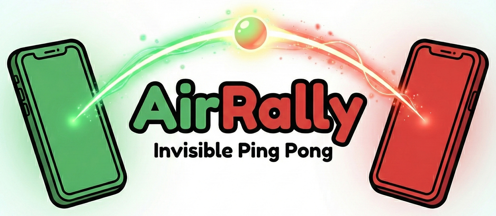

AirRally is a motion-controlled table tennis game that turns your Android phone into a paddle. Connect with nearby friends over Bluetooth and swing your devices to rally an invisible ball back and forth.

## Features

*   **Local Multiplayer:** Connect with a friend over Bluetooth. Play in Rally Mode or in a Classic 1v1 Ping Pong match.
*   **Motion Controls:** Use your phone as a paddle. Hit the ball with varied force and direction.
*   **Effects:** Visual and audio feedback for hits, misses, and wins.
*   **Achievements:** Unlock new player avatars as you reach higher levels.
*   **Localization:** 10+ languages.

## Getting Started

1.  **Install:** Download the APK from the Releases section onto two Android devices.
2.  **Connect:** Follow on screen instructions to connect to each other over Bluetooth.
3.  **Play:** Swing away!

## License

Creative Commons Attribution-NonCommercial 4.0 International License
[CC BY-NC 4.0](http://creativecommons.org/licenses/by-nc/4.0/)

