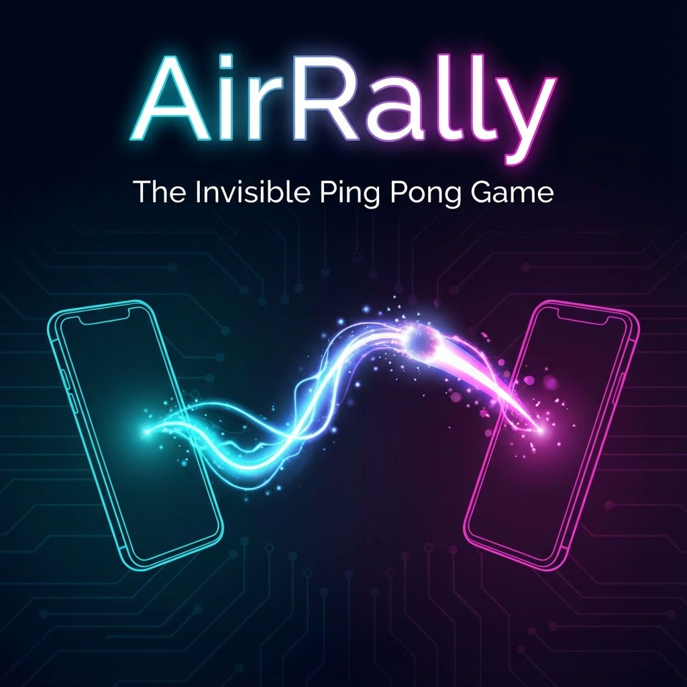

# AirRally

AirRally is a motion-controlled table tennis game that turns your Android phone into a paddle. Connect with nearby friends over Bluetooth and swing your devices to rally an invisible ball back and forth with each other.

## Features

*   **Local Multiplayer:** Connect with a friend over Bluetooth to play a 1v1 Ping Pong match.
*   **Motion Controls:** Use your phone as a paddle. Hit the ball with varied force and direction.
*   **Sound Effects:** Audio feedback for hits, misses, and wins.

## Getting Started

1.  **Install:** Download the APK from the Releases section.
2.  **Connect:** Follow on screen instructions to connect to a nearby device.
3.  **Play:** Swing away!

## License

MIT License

