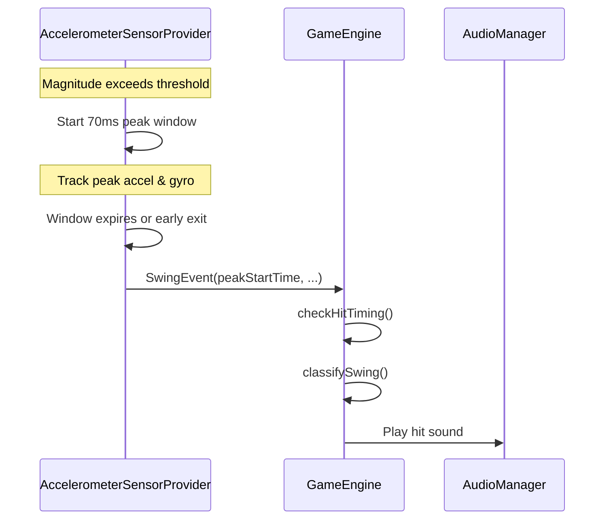

# Sensor System Documentation

This document describes the sensor system used for swing detection and classification in Air Rally.

## Overview

The game uses three sensors to detect and classify player swings:

| Sensor | Purpose | Sampling Rate |
|--------|---------|---------------|
| Linear Acceleration | Swing force/magnitude detection | ~20ms (`SENSOR_DELAY_GAME`) |
| Gravity | Swing type classification (Lob/Flat/Smash) | ~20ms |
| Gyroscope | Spin detection (Top/Under/Side) | ~20ms |

## Swing Detection Flow



## Peak Detection Algorithm

The sensor provider uses a **70ms peak detection window** to find the maximum acceleration during a swing:

```
1. Threshold Exceeded → Start collecting peak
2. For 70ms: Track highest acceleration magnitude
3. Also track: Peak gyroscope magnitude (for spin)
4. Use gravity at END of window (captures wrist snap)
5. Emit SwingEvent with timestamp = START of swing
```

### Key Implementation Details

```kotlin
// AccelerometerSensorProvider.kt
private val PEAK_WINDOW_MS = 70L
private val DEBOUNCE_MS = 500L  // Prevent rapid-fire swings

// Peak gyro is tracked independently of peak accel
val currentGyroMag = sqrt(lastGyroX² + lastGyroY² + lastGyroZ²)
if (currentGyroMag > peakGyroMagnitude) {
    peakGyroX = lastGyroX
    peakGyroY = lastGyroY
    peakGyroZ = lastGyroZ
}
```

### Early Exit Optimization

For **hard swings** (force > 44.0), the peak window exits early to reduce audio latency:

```kotlin
if (peakMagnitude > 44.0f) {
    // Emit immediately, don't wait for 70ms window
    _swingEvents.tryEmit(eventToEmit)
}
```

## Timestamp Compensation

**Critical**: The `SwingEvent.timestamp` is set to `peakStartTime` (when the swing started), NOT when the peak was detected.

This compensates for the ~70ms detection delay:
- Swing starts at T=1000ms
- Peak detection finishes at T=1070ms
- SwingEvent.timestamp = 1000ms (not 1070ms)
- Game calculates timing window from T=1000ms

## Swing Classification

### Force Classification (Acceleration)

Based on magnitude thresholds (configurable):

| Intensity | Threshold | Default |
|-----------|-----------|---------|
| Soft | `force > softThreshold` | 14.0 m/s² |
| Medium | `force > mediumThreshold` | 23.0 m/s² |
| Hard | `force > hardThreshold` | 44.0 m/s² |

### Type Classification (Gravity Z)

Based on phone tilt at moment of swing:

| Type | Condition | Description |
|------|-----------|-------------|
| Lob | `gravZ > 5.0` | Screen tilted up |
| Smash | `gravZ < -5.0` | Screen tilted down |
| Flat | otherwise | Screen vertical |

Resulting in 9 swing types: `SOFT_FLAT`, `MEDIUM_LOB`, `HARD_SMASH`, etc.

### Spin Classification (Gyroscope)

Based on peak rotation during swing. Y and Z axes are evaluated **independently**:

| Spin | Condition | Description |
|------|-----------|-------------|
| Top | `peakGy < -10` | Wrist rolls forward |
| Under | `peakGy > 10` | Wrist rolls backward |
| Right | `peakGz > 8` | Horizontal rotation right |
| Left | `peakGz < -8` | Horizontal rotation left |
| None | otherwise | No significant spin |

**Combined spins**: `TOP_RIGHT`, `UNDER_LEFT`, etc. when both axes exceed thresholds.

### Automatic Handedness Detection

The game automatically detects which hand is holding the phone using gravity readings during **flat hits**:

| Phone Orientation | gravX | Detected Hand |
|-------------------|-------|---------------|
| Screen faces left | ≈ +9.6 | Right |
| Screen faces right | ≈ -9.6 | Left |

**Detection Logic:**
- Only samples during flat hits (phone perpendicular to ground: `|gravZ| < 4`)
- Uses Exponential Moving Average (EMA) with α=0.3 for smooth detection
- Inverts the Y-axis gyroscope when left-handed, ensuring correct top/back spin classification

**Why needed:** The Android gyroscope coordinate system is fixed. Left-handed players hold the phone in a mirrored orientation, which inverts the Y-axis sign—causing topspin to be detected as backspin and vice versa.

**Debug display:** Settings → Debug Settings → Sensor Hit Test shows "Detected Hand: Left/Right (gravX EMA: X.X)"

## Hit Window Timing

### Window Calculation

```
Base Window = Difficulty setting (300-1200ms)
Rally Shrink = currentRallyLength × 10ms
Swing Shrink = opponent's swing type shrink %
Final Window = max(MIN_HIT_WINDOW, calculated)
```

Where `MIN_HIT_WINDOW = 300ms` is an absolute floor.

### Window Position

```
    ←───── Flight Time ─────→
[Opponent Hits]              [Ball Arrives]
                    ↓               ↓
    ──────────────[=====HIT WINDOW=====]──────────
                 -200ms           +Window
                  ↑                  ↑
              BOUNCE_OFFSET      Window End
```

- Window **starts** 200ms BEFORE arrival (anticipate the bounce)
- Window **ends** at start + totalWindow

### Edge Case: Fast Shots

For very fast shots (Hard Smash = 0.3× flight time = ~210ms), the window might start before the minimum reaction time (200ms).

**Safety check**: If `timeSinceLaunch < MIN_REACTION_TIME_MS`, the hit is rejected as `MISS_EARLY`.

### Auto-Miss Buffer

The auto-miss timer includes a **500ms buffer** after the hit window closes:

```kotlin
autoMissDelay = timeToArrival + endWindow + AUTO_MISS_BUFFER_MS
```

This ensures swings that START in the window but FINISH after (due to 70ms peak detection) are still registered correctly.

## Data Flow

### SwingEvent Structure

```kotlin
data class SwingEvent(
    val timestamp: Long,     // peakStartTime (compensated)
    val force: Float,        // Peak acceleration magnitude
    val x: Float, y: Float, z: Float,  // Accel components
    val gx: Float, gy: Float, gz: Float,  // Current gyro
    val peakGx: Float, peakGy: Float, peakGz: Float,  // Peak gyro
    val gravX: Float, gravY: Float, gravZ: Float  // End-of-swing gravity
)
```

### SwingData (Debug Display)

Subset stored in GameState for UI display:

```kotlin
data class SwingData(
    val force: Float,
    val accelX: Float, accelY: Float, accelZ: Float,
    val gyroX: Float, gyroY: Float, gyroZ: Float,
    val peakGyroX: Float, peakGyroY: Float, peakGyroZ: Float,
    val gravX: Float, gravY: Float, gravZ: Float
)
```

## Testing Sensors

The Debug Settings screen includes a **Sensor Hit Test** section:

1. Navigate to Settings → Debug Settings
2. Scroll to "Sensor Hit Test"
3. Swing the phone to see:
   - Swing type (e.g., "MEDIUM FLAT")
   - Spin type (e.g., "TOP RIGHT")
   - Force value
   - Raw sensor values (Accel, Gyro, Peak Gyro, Gravity)
   - Calibrated thresholds

## Calibration

Players can calibrate swing thresholds via Settings → Calibration:

1. Perform 5 swings at each intensity (soft, medium, hard)
2. System calculates optimal thresholds
3. Thresholds are persisted to SharedPreferences
